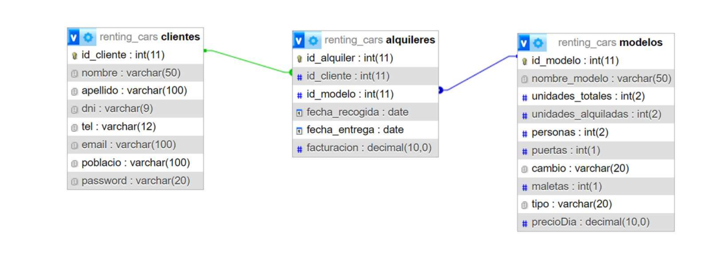

# Información

## Inicio (v01)
### Tabla bdd

### Reservas
En la tabla alquileres(de la base de datos), en unidades_alquiladas, eliminamos dicha columna, para facilitar el uso de las bdd y evitar el uso de triggers.

En la tabla(de la parte del servidor, ruta "/"), en unidades_alquiladas, mostrar la cantidad de vehículos que se han alquilado?